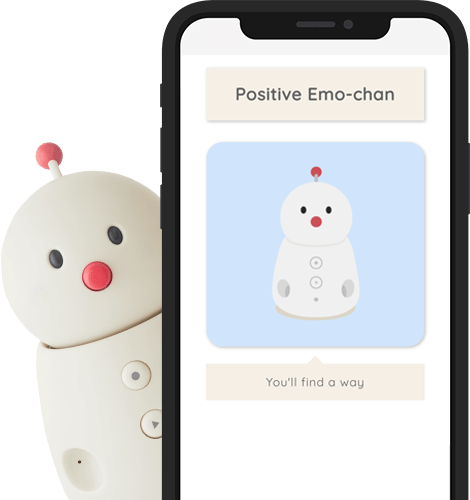

# Positive Emo-chan

<!-- PROJECT LOGO -->
<br />
<div align="center">
  <a href="https://github.com/AnaScuturici/Positive-Emo">
    
  </a>

<h3 align="center">Positive Emo-chan</h3>

  <p align="center">
    This was developed during our time as students at <a href="https://www.codechrysalis.io/">Code Chrysalis</a> 
    <br />
    <a href="https://github.com/AnaScuturici/Positive-Emo"><strong>Explore the docs »</strong></a>
    <br />
    <br />
    <a href="https://github.com/github_username/repo_name">View Demo</a>
    ·
    <a href="https://github.com/AnaScuturici/Positive-Emo/issues">Report Bug</a>
    ·
    <a href="https://github.com/AnaScuturici/Positive-Emo/issues">Request Feature</a>
  </p>
</div>

<!-- TABLE OF CONTENTS -->
<details>
  <summary>Table of Contents</summary>
  <ol>
    <li>
      <a href="#about-the-project">About The Project</a>
    </li>
    <li>
      <a href="#getting-started">Getting Started</a>
      <ul>
        <li><a href="#prerequisites">Prerequisites</a></li>
        <li><a href="#installation">Starting the application</a></li>
      </ul>
    </li>
    <li><a href="#built-with">Built with</a></li>
    <li><a href="#deployment">Deployment</a></li>
    <li><a href="#contributing">Contributing</a></li>
    <li><a href="#acknowledgments">Acknowledgments</a></li>
  </ol>
</details>

<div align="center">

</div>

Positive Emo-chan is a simple app based on the [BOCCO emo robot](https://www.bocco.me/en/). It utilizes the API developed by [Yukai-Engineering](https://www.ux-xu.com/en).
The purpose of the app is for the users to interact with and receive encouraging messages from Emo-chan.

## Getting Started

Please follow the instructions below for a guide on how to run the application on your local machine.

### Prerequisites

1. Clone the repository on your local machine: 
```sh 
git clone https://github.com/AnaScuturici/Positive-Emo.git
```
2. Install all dependencies with 
```sh
npm install
```
3. Use the sample.env file to set up the environment variables:  
    REACT_APP_ROOM_ID=`your_room_id`  
    REACT_APP_REFRESH_TOKEN=`your_refresh_token`  

### Starting the application

In order to get your development environment going please enter 
```sh 
npm run react
``` 
in your terminal to start the app at http://localhost:3000/

## Built with

[Reactjs](https://reactjs.org/)  
[Expressjs](https://expressjs.com/)  

[Yukai Engineering API](https://platform-api.bocco.me/api-docs/)  
We used an open-source api as a source for the [affirmations](https://github.com/annthurium/affirmations.git)

## Deployment

This application has been deployed on [Heroku](https://positive-emo.herokuapp.com/)

## Contributing

**Team Positive-Emo**  
Tech lead: [Ana Scuturici](https://github.com/AnaScuturici)   
Frontend: [Mei Omomo](https://github.com/mei-omomo) & [Roman Montoya](https://github.com/Roman4u)  
Backend: [Motoki Mizuno](https://github.com/Motoki-tech)

## Acknowledgments

Many thanks to [Yukai Engineering](https://www.ux-xu.com/en) for providing the API and the support during the development of the application.
Everyone at [Code Chrysalis](https://www.codechrysalis.io/), CC24 & J7 cohorts.
